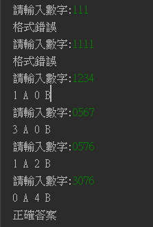

# 猜數字

##  如何執行/遊戲說明

### 執行方式 
    執行1A2B.py檔案
    
### 遊戲說明
    此為不重複數字版

    在輸入介面輸入數字，要是格式錯誤，如字數少於或多於4、重複數字等會顯示錯誤
    如果輸入正確，在輸入的數字中有出現正確答案但位置卻不對的話，會被分類為A，若位置正確則會是B
 


## 程式邏輯

### 整體邏輯
隨機從0-9中挑選數字，再把挑選出來的數字從原本的list中移除，重複四次後開始讓使用者
輸入答案，要是答案的格式正確的話就開始判斷A、B的數量，之後顯示AB數量，如果B為四個
的話就代表全部猜對，即結束遊戲，反之繼續猜數字。

### CheckA
    目的是為了判斷有幾個A
```python
def ChechA(num, ans):
    # 判斷A的個數
    a = 0
    for i in range(0, 4):
        for j in range(1, 4):
            if num[i] == int(ans[i - j]):
                a += 1
    return a
```

### CheckB
    目的為判斷有幾個B
```python
def CheckB(num, ans):
    # 判斷B的個數
    b = 0
    for i in range(4):
        if num[i] == int(ans[i]):
            b += 1
    return b
```

### CheckValid
目的是判斷使用者有沒有輸入錯誤的數字，如重複數字或是字數不對等
```python
def ChechValid(num):
    for i in range(4):
        for j in range(i):
            if num[i] == num[j]:
                return False
    return True
```

### 生成答案
在整個程式中會先生成一個不重複四位數字的list，方法為下
```python
value = [i for i in range(0, 10)]
num = []
# 生成四個不一樣的數字
for i in range(4):
    num.append(random.choice(value))
    value.remove(num[i])
print(num)
```


